# Guía usuario

El menú de usuario despliega 5 opciones como las que se muestran a continuación.

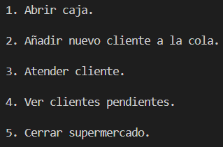

Será necesario introducir un "1" para seleccionar la primera opción, "Abrir caja", para poder añadir clientes a la cola así como atenderlos y ver cuantos quedan por atender, sin embargo, se podrá introducir "5" para cerrar el supermercado aun cuando la caja no haya sido abierta.

Una vez introducido "1", se mostrará un mensaje indicando que se ha abierto la caja y si tratamos de volver a introducir este valor se mostrará un mensaje indicando que ya esta abierta la caja.

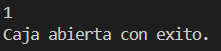

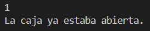

Una vez la caja esté abierta, si introducimos "2", se genererá un cliente con un nombre aleatorio así como con una pila de objetos aleatorios y se añadirá a la cola de la caja, estará listo para atender.
Si tratamos de introducir "3" o "4" sin haber seleccionado "2" previamente se mostrará un mensaje indicando que no hay clientes por atender.

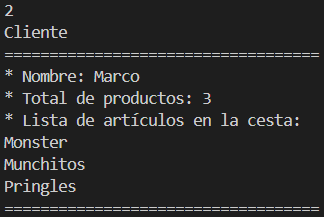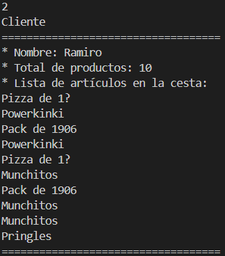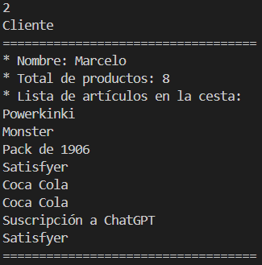

Tras haber abierto la caja e introducido clientes, si introducimos "3" se mostrará un mensaje indicando el nombre del cliente en la primera posición de la cola así como que ha sido atendido, por último este mismo cliente será eliminado de la cola.

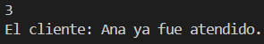 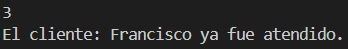

Si aún quedan clientes por atender, e introducimos "4", se mostrará un mensaje indicando la caja en la que nos encontramos, el total de clientes en fila, el nombre de cada cliente y los productos en cesta de cada uno.

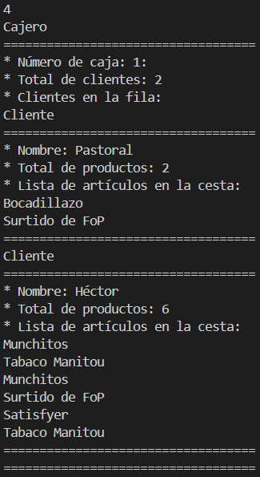

Si seleccionamos esta opción pero aún no hay clientes en fila, se mostrará un mensaje como el de la siguiente imagen.

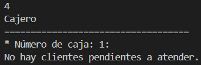

Por último, si se introduce "5" y aún quedan clientes por atender en la caja, se mostrará un mensaje indicando que no se puede cerrar la caja hasta que se termine de atender a los clientes, sin embargo, si no quedan clientes en la caja o la caja no está abierta aún, se mostrará un mensaje de despedida y finalizará el programa.

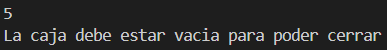 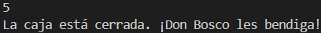

Para volver al fichero README pulse el siguiente enlace [README](/README.md).